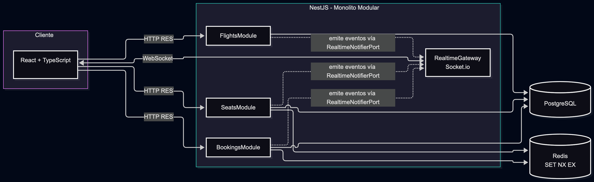

# Arquitectura del sistema

## 1. Diagrama de arquitectura

## 2. Justificación de la arquitectura

### ADR-001: Monolito Modular

**Decisión**: Monolito Modular con NestJS, con separación por dominios (`flights`, `seats`, `bookings`, `realtime`).

**Razón**: Suficiente para una prueba técnica; evita la complejidad operativa de microservicios o brokers externos; permite comunicación directa entre los módulos de dominio y el Gateway de Socket.io; mantiene dependencias unidireccionales claras hacia `realtime`.

### ADR-002: Socket.io embebido, sin message broker externo

**Decisión**: Socket.io corre en el mismo proceso de NestJS (Escenario A), sin Redis Pub/Sub ni ningún broker de mensajería.

**Razón**: Arquitectura de instancia única — un solo proceso NestJS. No hay necesidad de sincronizar eventos entre instancias.

**Limitación documentada**: si se escalara a múltiples instancias de NestJS, los clientes conectados a una instancia no recibirían eventos emitidos desde otra. **Mejora futura**: activar `@socket.io/redis-adapter` sobre el mismo Redis ya usado para los bloqueos, sin cambiar la lógica de negocio.

### ADR-003: Hexagonal-lite dentro de cada módulo de dominio

**Decisión**: Dentro de `flights`, `seats` y `bookings` se usa un enfoque **Hexagonal-lite**, no Hexagonal estricto ni Clean Architecture de 4 anillos completos.

Solo se aíslan detrás de `ports/` (interfaces) las fronteras volátiles o que necesitan mockearse en tests:
- Persistencia (repositorio de datos)
- Lock de asientos en Redis
- Notificación en tiempo real (Socket.io)

Los casos de uso (`application/`) orquestan las reglas de dominio contra esos ports. Los endpoints triviales de solo lectura (`GET /flights`) **no** pasan por la ceremonia completa de ports — van directo del controller a un servicio/repositorio simple.

**Razón**: es una prueba técnica, no un sistema de producción. El objetivo es máxima señal de criterio arquitectónico (desacoplar justo las fronteras que probablemente cambien o se necesiten mockear) con el mínimo esfuerzo/boilerplate posible. Hexagonal estricto o Clean Architecture de 4 anillos añadirían mapeos DTO↔Domain y ports de entrada/salida en fronteras triviales, lo cual sería sobreingeniería para este alcance.

**Excepción documentada — Gateway WS único**: `RealtimeGateway` cumple doble función: implementa `RealtimeNotifierPort` (salida, usado por `seats`/`bookings`/`flights` para emitir eventos) y además escucha directamente el evento de entrada `seat:block`, invocando los casos de uso de `seats/application/`. Esto introduce un acoplamiento acotado `realtime -> seats.application`. Se documenta como decisión consciente: la regla de dependencia unidireccional aplica al *port de notificación de dominio* (nadie fuera de `realtime` importa la clase concreta `RealtimeGateway`), no al gateway como pieza de infraestructura de transporte WS, que funcionalmente actúa como un controller de entrada — igual que cualquier controller HTTP. La alternativa (un segundo gateway dentro de `seats/infrastructure/ws/`) preservaría la regla al 100% pero añade una carpeta y un gateway extra sin aportar señal adicional para el alcance de esta prueba.

## 3. Manejo de concurrencia y estado en tiempo real

**Bloqueo de asientos**: se usa el comando atómico de Redis `SET seat:block:<seatId> <clientId> EX 600 NX`. `NX` garantiza que solo se escribe la key si no existe — si dos usuarios intentan bloquear el mismo asiento al mismo tiempo, solo uno obtiene un resultado distinto de `null`; el otro recibe `ConflictException`. El value del lock es el **`clientId` estable** del cliente (token persistido en `sessionStorage`), no el id del socket: el socket id cambia en cada reconexión, pero la reserva no debe perderse por un parpadeo de red. El TTL de 600 segundos (10 minutos) es el límite real de la reserva si el usuario no completa la compra.

**La reserva sobrevive a la desconexión (y la recupera el mismo usuario)**: el lock vive en Redis bajo el `clientId` del usuario, así que una desconexión/reconexión (nueva conexión de Socket.io con id distinto) no libera el asiento. Al reconectar, el cliente re-emite el `JOIN_FLIGHT` y re-fetch del mapa para recuperar los eventos perdidos y el `expiresAt` restante real (calculado del TTL que aún queda en Redis). El asiento se muestra "bloqueado por mí" mientras el `clientId` del usuario coincida con el dueño del lock. Un `sessionStorage` por pestaña evita que dos pestañas del mismo navegador compartan (y se roben) reservas.

**Liberación por expiración (no por desconexión)**: cuando el TTL de Redis vence no hay escritura a BD que despierte un listener, así que la liberación se conduce desde el Gateway: al bloquear se programa un timer in-process con el mismo TTL (`SEAT_LOCK_TTL_SECONDS`) que, al dispararse, ejecuta la liberación (compare-and-delete) y difunde `SEAT_RELEASED` a toda la room — el asiento se **disponibiliza y el countdown desaparece** al instante para todos los clientes. El frontend tiene además una red de seguridad local: al llegar el `blockExpiresAt` a cero libera el asiento en su propia vista aunque el broadcast se haya perdido. Al liberar manualmente el asiento o cambiarlo, se cancela el timer pendiente. Se descartó usar **keyspace notifications de Redis** (`--notify-keyspace-events Ex`) porque exigen configuración extra del servidor Redis y no aportan robustez adicional relevante para una arquitectura de instancia única. **Limitación documentada**: el timer es in-process (arquitectura de instancia única, ADR-002); si el backend se reinicia, los timers se pierden pero el TTL de Redis sigue reteniendo el lock — al expirar sin broadcast, el cliente propietario se auto-libera por su red de seguridad local y el resto de clientes se corrige al reconectar (resync) o recargar.

**Cambio de asiento atómico (block-first, release-after)**: para mover la reserva a otro asiento el frontend **bloquea el nuevo primero** y solo después libera el anterior (`handleSeatClick` en `SeatSelectionPage`). Si el bloqueo del nuevo falla (otro usuario se adelantó), el usuario conserva su reserva actual: nunca se queda sin asiento. El orden original (liberar primero y luego bloquear) dejaba una ventana en la que otro cliente podía ganar el asiento recién liberado, dejando al usuario sin ninguno. Se descartó un comando Redis atómico de *switch* (script Lua) por considerarse sobreingeniería para el alcance de la prueba: cada paso individual ya es atómico (`SET NX` y el script compare-and-delete) y el invariante importante —nunca terminar con cero asientos— se garantiza con el orden.

**Confirmación de reserva**: al confirmar, se verifica primero que el socket que confirma es el mismo que posee el bloqueo vigente en Redis (evita que otro cliente confirme un asiento bloqueado por alguien más). Luego se ejecuta una **transacción de PostgreSQL** (vía TypeORM) que crea el `Booking` y actualiza el `Seat` a `OCCUPIED` de forma atómica. Al terminar, se borra la key de Redis y se emite `SEAT_OCCUPIED` a todos los clientes conectados al vuelo.

Esta combinación (lock atómico en Redis + transacción atómica en Postgres) es lo que previene el *double booking*: ningún asiento puede quedar "reservado" por dos personas a la vez, ni a nivel de bloqueo temporal ni a nivel de confirmación definitiva.

## 4. Decisiones técnicas clave

| Decisión | Justificación |
|---|---|
| **TypeORM + PostgreSQL** | ORM maduro para NestJS, soporte de transacciones necesario para la confirmación atómica de reservas. |
| **Redis (`ioredis`) para locks TTL** | Estructura de datos simple y atómica (`SET NX EX`), evita condiciones de carrera sin necesitar locks distribuidos más complejos. |
| **Socket.io** | Manejo de rooms por vuelo (`flight:{flightId}`) out-of-the-box, reconexión automática, buen soporte en NestJS vía `@nestjs/platform-socket.io`. |
| **Vite (frontend)** en vez de Create React App | CRA está deprecado; Vite ofrece arranque y HMR más rápidos con configuración mínima. |
| **Path mapping (`@shared/*`) en vez de npm workspaces** | El paquete `/shared` es solo código TypeScript (enums, tipos de eventos) consumido por referencia; no hay necesidad de publicarlo ni versionarlo como paquete independiente para el alcance de esta prueba técnica. Si el proyecto creciera a monorepo real con paquetes publicables, ahí se justificaría una herramienta como Nx o pnpm workspaces. |
| **Docker Compose** | Levanta Postgres, Redis, backend y frontend con un solo comando, reproducible sin instalar nada localmente salvo Docker. |
