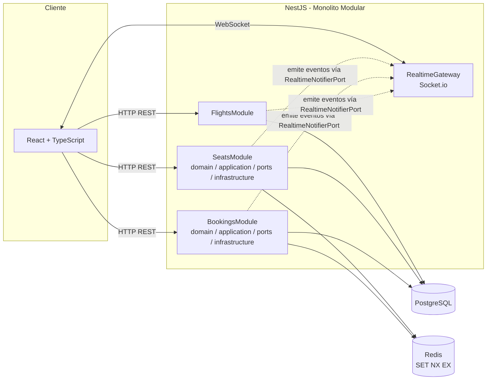

# Arquitectura del sistema

## 1. Diagrama de arquitectura

## 2. Justificación de la arquitectura

### ADR-001: Monolito Modular

**Decisión**: Monolito Modular con NestJS, con separación por dominios (`flights`, `seats`, `bookings`, `realtime`).

**Razón**: Suficiente para una prueba técnica; evita la complejidad operativa de microservicios o brokers externos; permite comunicación directa entre los módulos de dominio y el Gateway de Socket.io; mantiene dependencias unidireccionales claras hacia `realtime`.

### ADR-002: Socket.io embebido, sin message broker externo

**Decisión**: Socket.io corre en el mismo proceso de NestJS (Escenario A), sin Redis Pub/Sub ni ningún broker de mensajería.

**Razón**: Arquitectura de instancia única — un solo proceso NestJS. No hay necesidad de sincronizar eventos entre instancias.

**Limitación documentada**: si se escalara a múltiples instancias de NestJS, los clientes conectados a una instancia no recibirían eventos emitidos desde otra. **Mejora futura**: activar `@socket.io/redis-adapter` sobre el mismo Redis ya usado para los bloqueos, sin cambiar la lógica de negocio.

### ADR-003: Hexagonal-lite dentro de cada módulo de dominio

**Decisión**: Dentro de `flights`, `seats` y `bookings` se usa un enfoque **Hexagonal-lite**, no Hexagonal estricto ni Clean Architecture de 4 anillos completos.

Solo se aíslan detrás de `ports/` (interfaces) las fronteras volátiles o que necesitan mockearse en tests:
- Persistencia (repositorio de datos)
- Lock de asientos en Redis
- Notificación en tiempo real (Socket.io)

Los casos de uso (`application/`) orquestan las reglas de dominio contra esos ports. Los endpoints triviales de solo lectura (`GET /flights`) **no** pasan por la ceremonia completa de ports — van directo del controller a un servicio/repositorio simple.

**Razón**: es una prueba técnica, no un sistema de producción. El objetivo es máxima señal de criterio arquitectónico (desacoplar justo las fronteras que probablemente cambien o se necesiten mockear) con el mínimo esfuerzo/boilerplate posible. Hexagonal estricto o Clean Architecture de 4 anillos añadirían mapeos DTO↔Domain y ports de entrada/salida en fronteras triviales, lo cual sería sobreingeniería para este alcance.

**Excepción documentada — Gateway WS único**: `RealtimeGateway` cumple doble función: implementa `RealtimeNotifierPort` (salida, usado por `seats`/`bookings`/`flights` para emitir eventos) y además escucha directamente el evento de entrada `seat:block`, invocando los casos de uso de `seats/application/`. Esto introduce un acoplamiento acotado `realtime -> seats.application`. Se documenta como decisión consciente: la regla de dependencia unidireccional aplica al *port de notificación de dominio* (nadie fuera de `realtime` importa la clase concreta `RealtimeGateway`), no al gateway como pieza de infraestructura de transporte WS, que funcionalmente actúa como un controller de entrada — igual que cualquier controller HTTP. La alternativa (un segundo gateway dentro de `seats/infrastructure/ws/`) preservaría la regla al 100% pero añade una carpeta y un gateway extra sin aportar señal adicional para el alcance de esta prueba.

## 3. Manejo de concurrencia y estado en tiempo real

**Bloqueo de asientos**: se usa el comando atómico de Redis `SET seat:block:<seatId> <valor> EX 600 NX`. `NX` garantiza que solo se escribe la key si no existe — si dos usuarios intentan bloquear el mismo asiento al mismo tiempo, solo uno obtiene un resultado distinto de `null`; el otro recibe `ConflictException`. El TTL de 600 segundos (10 minutos) libera automáticamente el bloqueo si el usuario no completa la compra.

**Liberación por desconexión**: si el socket se desconecta con un asiento bloqueado, `handleDisconnect` en el Gateway libera la key correspondiente en Redis y notifica a todos los clientes (`SEAT_RELEASED`).

**Confirmación de reserva**: al confirmar, se verifica primero que el socket que confirma es el mismo que posee el bloqueo vigente en Redis (evita que otro cliente confirme un asiento bloqueado por alguien más). Luego se ejecuta una **transacción de PostgreSQL** (vía TypeORM) que crea el `Booking` y actualiza el `Seat` a `OCCUPIED` de forma atómica. Al terminar, se borra la key de Redis y se emite `SEAT_OCCUPIED` a todos los clientes conectados al vuelo.

Esta combinación (lock atómico en Redis + transacción atómica en Postgres) es lo que previene el *double booking*: ningún asiento puede quedar "reservado" por dos personas a la vez, ni a nivel de bloqueo temporal ni a nivel de confirmación definitiva.

## 4. Decisiones técnicas clave

| Decisión | Justificación |
|---|---|
| **TypeORM + PostgreSQL** | ORM maduro para NestJS, soporte de transacciones necesario para la confirmación atómica de reservas. |
| **Redis (`ioredis`) para locks TTL** | Estructura de datos simple y atómica (`SET NX EX`), evita condiciones de carrera sin necesitar locks distribuidos más complejos. |
| **Socket.io** | Manejo de rooms por vuelo (`flight:{flightId}`) out-of-the-box, reconexión automática, buen soporte en NestJS vía `@nestjs/platform-socket.io`. |
| **Vite (frontend)** en vez de Create React App | CRA está deprecado; Vite ofrece arranque y HMR más rápidos con configuración mínima. |
| **Path mapping (`@shared/*`) en vez de npm workspaces** | El paquete `/shared` es solo código TypeScript (enums, tipos de eventos) consumido por referencia; no hay necesidad de publicarlo ni versionarlo como paquete independiente para el alcance de esta prueba técnica. Si el proyecto creciera a monorepo real con paquetes publicables, ahí se justificaría una herramienta como Nx o pnpm workspaces. |
| **Docker Compose** | Levanta Postgres, Redis, backend y frontend con un solo comando, reproducible sin instalar nada localmente salvo Docker. |
